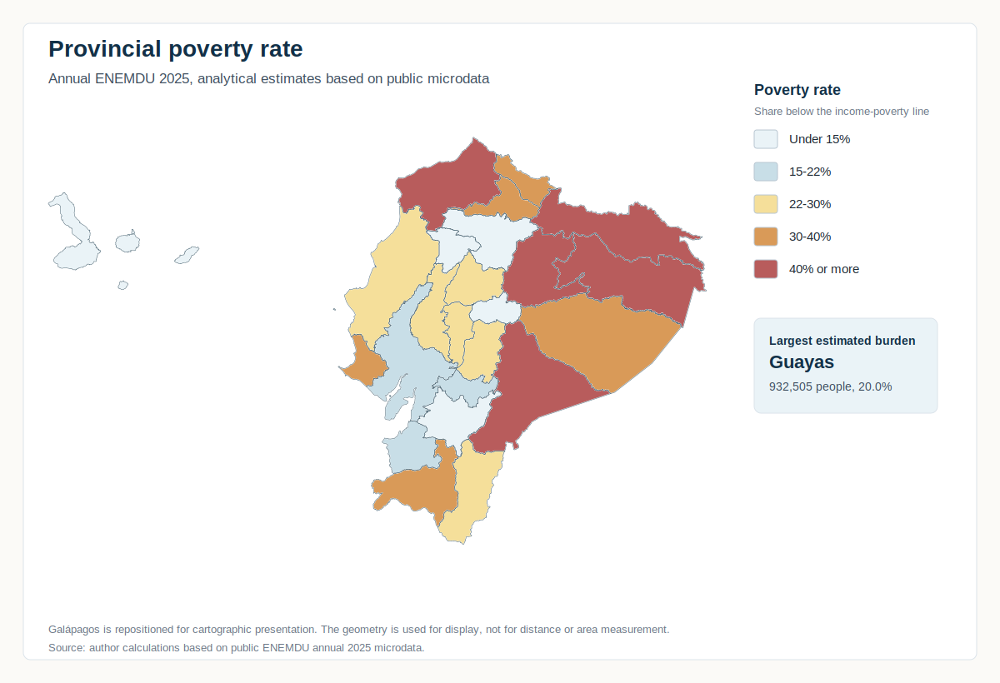

```{=html}
<style>
.territory-hero {
  grid-template-columns: minmax(0, 1fr) minmax(320px, 380px);
  gap: clamp(2rem, 5vw, 4.5rem);
}

.territory-scope-card {
  align-self: center;
  min-width: 0;
}

.territory-scope-list {
  display: grid;
  gap: 0.72rem;
  margin: 0;
}

.territory-scope-list div {
  border-top: 1px solid rgba(18, 48, 71, 0.1);
  display: grid;
  gap: 0.2rem;
  grid-template-columns: minmax(5.2rem, 0.45fr) minmax(0, 1fr);
  padding-top: 0.72rem;
}

.territory-scope-list div:first-child {
  border-top: 0;
  padding-top: 0;
}

.territory-scope-list dt {
  color: var(--epm-muted);
  font-size: 0.76rem;
  font-weight: 760;
  letter-spacing: 0.06em;
  text-transform: uppercase;
}

.territory-scope-list dd {
  color: var(--epm-navy);
  font-size: 0.98rem;
  font-weight: 720;
  margin: 0;
}

.territory-map-card {
  background: var(--epm-surface);
  border: 1px solid var(--epm-border);
  border-radius: 8px;
  box-shadow: 0 12px 28px rgba(18, 48, 71, 0.06);
  margin: 1.5rem 0;
  padding: clamp(0.85rem, 2vw, 1.25rem);
}

.territory-map-card img {
  display: block;
  height: auto;
  width: 100%;
}

.territory-caption {
  color: var(--epm-muted);
  font-size: 0.98rem;
  line-height: 1.55;
  margin: 0.8rem 0 0;
}

.territory-table-wrap {
  overflow-x: auto;
}

.territory-table-wrap table {
  margin-bottom: 0.4rem;
  min-width: 760px;
}

.territory-table-wrap th {
  color: var(--epm-navy);
  font-size: 0.86rem;
  letter-spacing: 0.03em;
  text-transform: uppercase;
}

.territory-table-wrap td,
.territory-table-wrap th {
  vertical-align: middle;
}

.territory-meter {
  background: #e9ecef;
  border-radius: 999px;
  height: 0.72rem;
  overflow: hidden;
}

.territory-meter span {
  background: var(--epm-blue);
  display: block;
  height: 100%;
}

@media (max-width: 900px) {
  .territory-hero {
    grid-template-columns: minmax(0, 1fr);
  }
}

@media (max-width: 560px) {
  .territory-scope-list div {
    grid-template-columns: minmax(0, 1fr);
  }
}
</style>
```

```{r}
#| include: false
site_output_path <- file.path(
  "data",
  "derived",
  "site",
  "site_territorial_province_income_poverty.rds"
)

if (!file.exists(site_output_path)) {
  site_output_path <- file.path(
    "..",
    "data",
    "derived",
    "site",
    "site_territorial_province_income_poverty.rds"
  )
}

if (!file.exists(site_output_path)) {
  stop("Provincial income-poverty data are not available.", call. = FALSE)
}

territorial <- readRDS(site_output_path)

required_columns <- c(
  "province_code",
  "province_name",
  "indicator_id",
  "display_estimate",
  "estimated_poor_count",
  "rank_by_estimated_poor_count",
  "rank_by_poverty_rate"
)

missing_columns <- setdiff(required_columns, names(territorial))
if (length(missing_columns) > 0L) {
  stop("Provincial income-poverty data are missing expected fields.", call. = FALSE)
}

poverty <- subset(territorial, indicator_id == "poverty_rate")
extreme_poverty <- subset(territorial, indicator_id == "extreme_poverty_rate")

if (length(unique(poverty$province_code)) != 24L) {
  stop("The poverty-rate table must contain 24 provinces.", call. = FALSE)
}

if (length(unique(extreme_poverty$province_code)) != 24L) {
  stop("The extreme-poverty table must contain 24 provinces.", call. = FALSE)
}

public_province_label <- function(values) {
  labels <- c(
    Bolivar = "Bol\u00edvar",
    Canar = "Ca\u00f1ar",
    Galapagos = "Gal\u00e1pagos",
    "Los Rios" = "Los R\u00edos",
    Manabi = "Manab\u00ed",
    Sucumbios = "Sucumb\u00edos",
    "Santo Domingo de los Tsachilas" = "Santo Domingo de los Ts\u00e1chilas"
  )

  out <- as.character(values)
  matched <- out %in% names(labels)
  out[matched] <- unname(labels[out[matched]])
  out
}

html_escape <- function(value) {
  value <- as.character(value)
  value <- gsub("&", "&amp;", value, fixed = TRUE)
  value <- gsub("<", "&lt;", value, fixed = TRUE)
  value <- gsub(">", "&gt;", value, fixed = TRUE)
  value <- gsub('"', "&quot;", value, fixed = TRUE)
  value
}

fmt_count <- function(value) {
  if (is.na(value)) {
    return("n.a.")
  }
  format(round(value), big.mark = ",", scientific = FALSE)
}

fmt_pct <- function(value, digits = 1L) {
  if (is.na(value)) {
    return("n.a.")
  }
  sprintf(paste0("%.", digits, "f%%"), as.numeric(value))
}

poverty$province_label <- public_province_label(poverty$province_name)
extreme_poverty$province_label <- public_province_label(extreme_poverty$province_name)

top5_poverty <- subset(poverty, !is.na(rank_by_estimated_poor_count))
top5_poverty <- top5_poverty[order(top5_poverty$rank_by_estimated_poor_count), ]
top5_poverty <- head(top5_poverty, 5L)

extreme_lookup <- extreme_poverty[, c("province_code", "display_estimate")]
names(extreme_lookup)[2] <- "extreme_display_estimate"
top5_poverty <- merge(
  top5_poverty,
  extreme_lookup,
  by = "province_code",
  all.x = TRUE,
  sort = FALSE
)
top5_poverty <- top5_poverty[order(top5_poverty$rank_by_estimated_poor_count), ]

top_rate <- subset(poverty, !is.na(rank_by_poverty_rate))
top_rate <- top_rate[order(top_rate$rank_by_poverty_rate), ]
top_rate <- head(top_rate, 5L)

top5_total_poor <- sum(top5_poverty$estimated_poor_count, na.rm = TRUE)
top_province <- top5_poverty$province_label[1]
top_province_count <- top5_poverty$estimated_poor_count[1]
top_province_rate <- top5_poverty$display_estimate[1]
highest_rate_province <- top_rate$province_label[1]
highest_rate <- top_rate$display_estimate[1]

top5_table <- function(data) {
  rows <- apply(
    data,
    1L,
    function(row) {
      paste0(
        "<tr>",
        "<td><strong>", as.integer(row[["rank_by_estimated_poor_count"]]), "</strong></td>",
        "<td><strong>", html_escape(row[["province_label"]]), "</strong></td>",
        "<td>", fmt_count(as.numeric(row[["estimated_poor_count"]])), "</td>",
        "<td>", fmt_pct(as.numeric(row[["display_estimate"]]), 1L), "</td>",
        "<td>", fmt_pct(as.numeric(row[["extreme_display_estimate"]]), 1L), "</td>",
        "</tr>"
      )
    }
  )

  paste0(
    '<div class="territory-table-wrap">',
    '<table class="table table-sm">',
    "<thead>",
    "<tr>",
    "<th>Rank</th>",
    "<th>Province</th>",
    "<th>Estimated people in poverty</th>",
    "<th>Poverty rate</th>",
    "<th>Extreme poverty rate</th>",
    "</tr>",
    "</thead>",
    "<tbody>",
    paste(rows, collapse = "\n"),
    "</tbody>",
    "</table>",
    "</div>"
  )
}

rate_bar <- function(row) {
  value <- as.numeric(row[["display_estimate"]])
  width <- max(0, min(100, value))
  paste0(
    '<div style="display: grid; grid-template-columns: minmax(9rem, 13rem) 1fr 4.5rem; gap: 0.75rem; align-items: center;">',
    "<span>", html_escape(row[["province_label"]]), "</span>",
    '<div class="territory-meter"><span style="width: ', sprintf("%.1f", width), '%;"></span></div>',
    '<strong style="text-align: right;">', fmt_pct(value, 1L), "</strong>",
    "</div>"
  )
}
```

::: {.internal-hero .internal-hero-wide .territory-hero}
::: {.internal-hero-copy}
::: {.section-kicker}
Territorial view
:::

# Territorial view of income poverty

::: {.story-lede}
Provincial patterns from annual ENEMDU 2025.
:::

Poverty is territorial in two different ways. Some provinces show higher poverty rates, while the largest population centers concentrate the greatest number of people living below the income-poverty line.
:::

::: {.internal-hero-card .territory-scope-card}
## What this view covers

<dl class="territory-scope-list">
<div>
<dt>Period</dt>
<dd>Annual ENEMDU 2025</dd>
</div>
<div>
<dt>Measure</dt>
<dd>Income poverty</dd>
</div>
<div>
<dt>Geography</dt>
<dd>24 provinces</dd>
</div>
<div>
<dt>Reading</dt>
<dd>Incidence and concentration</dd>
</div>
</dl>
:::
:::

::: {.content-block .editorial-flow}
::: {.story-panel}
::: {.section-kicker}
Executive signal
:::

## One map, two readings

The provincial map shows where poverty rates are highest. The executive table answers a different question: where the estimated number of people in poverty is largest.

That distinction matters. **`r highest_rate_province`** has the highest poverty rate among the provinces highlighted in the incidence comparison, while **`r top_province`** has the largest estimated number of people in poverty: about **`r fmt_count(top_province_count)`** people, with a poverty rate of **`r fmt_pct(top_province_rate, 1L)`**.
:::

::: {.territory-map-card}


::: {.territory-caption}
Provincial poverty rate, annual ENEMDU 2025. Analytical estimates based on public microdata. Galápagos is repositioned for cartographic presentation.
:::
:::

::: {.story-grid}
::: {.story-panel}
::: {.section-kicker}
Territorial incidence
:::

## Where rates are highest

```{r}
#| echo: false
#| results: asis
cat(paste(vapply(seq_len(nrow(top_rate)), function(i) rate_bar(top_rate[i, ]), character(1)), collapse = "\n"))
```

These rates compare the intensity of income poverty across provinces. They should be read as analytical estimates, especially for smaller domains where sampling uncertainty can matter.
:::

::: {.story-panel}
::: {.section-kicker}
Population concentration
:::

## Where the burden is largest

The five provinces in the executive table account for about **`r fmt_count(top5_total_poor)`** estimated people in poverty. This ranking is based on the estimated number of people in poverty, not only on the poverty rate.

This helps separate territorial incidence from population concentration: a province can have a lower rate and still contain many more people in poverty because its population is much larger.
:::
:::

::: {.infographic-frame}
::: {.section-kicker}
Executive table
:::

## Provinces with the largest estimated number of people in poverty

```{r}
#| echo: false
#| results: asis
cat(top5_table(top5_poverty))
```

The ranking is based on the estimated number of people in poverty. The poverty and extreme-poverty rates are included to keep incidence visible without turning the table into a rate ranking.
:::

::: {.method-note}
Source: author's calculations based on public ENEMDU annual 2025 microdata. Provincial estimates are analytical and should be read together with the [methodology page](04_methodology-quality.qmd). They do not replace official statistical releases.
:::

::: {.proof-strip}
::: {.proof-item}
**Incidence**

The map compares provincial poverty rates.
:::

::: {.proof-item}
**Concentration**

The table ranks estimated people in poverty.
:::

::: {.proof-item}
**Annual view**

The reading uses annual ENEMDU 2025.
:::

::: {.proof-item}
**Prudent use**

Provincial estimates are analytical and contextual.
:::
:::

::: {.page-nav}
[<- Deprivation and multidimensional poverty](03_deprivation-multidimensional-poverty.qmd)
[Methodology and statistical quality ->](04_methodology-quality.qmd)
:::
:::
